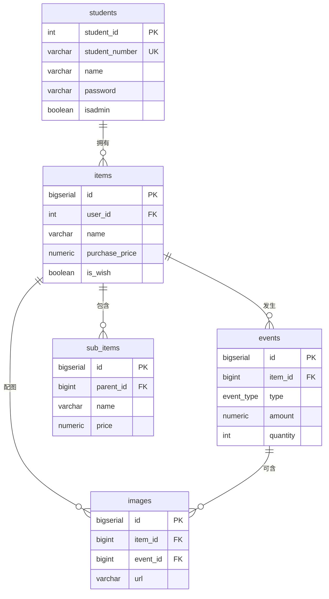

# 课程设计报告

**课程名称：** 软件框架技术应用

**课题名称：** 基于 Vue 3 + Vuetify 与 Bun 的物品生命周期记录系统（OneDay）

**专　　业：** 计算机学院

**班　　级：** ＿＿＿＿＿＿＿＿＿＿

**学　　号：** ＿＿＿＿＿＿＿＿＿＿

**姓　　名：** ＿＿＿＿＿＿＿＿＿＿

**指导教师：** 纪洪波

**日　　期：** 　　年　　月　　日

通化师范学院

\newpage

> 装订顺序说明：封面、任务书、目录、正文、评分表。本文件为正文初稿，封面/任务书/评分表为学校固定表格，请自行填写后按顺序装订。

\newpage

# 1. 需求分析

## 1.1 系统设计目的与意义

随着个人消费品数量不断增加，人们越来越关注"一件物品到底值不值、用得久不久、花了多少钱"。传统的记账软件只记录"花钱的一瞬间"，无法回答"这件物品在整个生命周期里到底产生了多少成本、平均每天花多少钱"。本系统 OneDay 以"物品"为核心，记录物品从购入、使用、维修、保养到出售的**完整生命周期**，自动折算日均成本与资产价值，并把"想买但还没买"的东西单独放进**心愿库**，帮助用户做出更理性的消费决策。

本系统选用 Bun + Elysia + PostgreSQL + Vue 3 + Vuetify 全栈技术栈，具有以下意义：

### 1.1.1 提升用户体验

- **响应式设计：** Vuetify 基于 Material Design，组件天然适配手机、平板、桌面多种屏幕，用户在任意设备上都能获得一致的浏览体验。
- **流畅交互：** 借助 Vue 3 的组合式 API（`ref` / `computed` / `reactive`）实现数据驱动视图，配合 Vuetify 的卡片、列表、对话框、骨架屏等组件，交互反馈即时流畅。

### 1.1.2 提高开发效率

- **组件化开发：** 前端按页面拆分为 Login、Register、Home、ItemAdd、ItemDetail、Library、Charts、Settings 等独立组件，可复用、易维护。
- **类型安全：** 后端使用 TypeScript + Elysia，请求体借助 `t`（TypeBox）做运行时校验，编译期与运行期双重保障。

### 1.1.3 优化性能

- **轻量运行时：** Bun 启动快、内置打包/测试，单文件即可运行后端服务。
- **本地化依赖：** 前端 Vue / Vuetify / Pinia / Vue Router 等全部 vendored 到本地 `public/` 目录，无需 CDN、无需 npm 安装，离线即可运行，启动与加载速度快。

### 1.1.4 信息展示与统计

- **信息展示：** 以卡片、列表、详情页直观展示物品名称、分类、购入价、状态、图标等信息。
- **数据统计：** 利用后端聚合查询 + 前端 `computed`，计算单件物品日均成本、总资产、分类占比，并在图表页可视化。

## 1.2 程序的功能

- **用户账户管理：** 用户可注册、登录账号；共用 `student_db` 的 `students` 表做学生鉴权；支持修改头像。
- **物品管理（CRUD）：** 新增、查看、编辑、删除物品；支持封面图标三选一（相册图片 / Emoji / 3D 图标）。
- **分类管理：** 新建物品时可在弹窗中选择已有分类或新建分类；支持分类重命名、删除。
- **生命周期事件：** 为每件物品追加购入、使用、保养、维修、耗材、出售等事件，记录金额、数量、时间、备注。
- **附加物品（子物品）：** 一件主物品下可挂多个配件/耗材子项，其价格**自动计入该物品的总成本与总资产**（如手机 + 贴膜 + 充电器）。
- **心愿库：** 把"想买但还没买"的东西单独记录在心愿库，**不计入总资产与日均成本**；真正买入后一键"移入资产"，自动生成购入事件。
- **统计与仪表盘：** 总资产、日均成本、分类汇总、单件统计（含附加物品成本）；图表页可视化展示。
- **批量操作：** 物品批量修改分类 / 批量删除。

## 1.3 输入输出的要求

系统对所有用户输入做格式校验，前端用 Vuetify 表单 `rules` 即时提示，后端再做兜底，与 student-servertest-main 保持一致。

**注册输入校验：**

| 字段 | 校验规则 |
|---|---|
| 学号 | 必填、长度 ≥ 5、必须以 `S` 开头后跟数字（正则 `^S\d+$`） |
| 姓名 | 必填、长度 ≤ 20 |
| 密码 | 必填、6 ~ 20 位 |
| 确认密码 | 必须与密码两次输入一致 |
| 性别 | 必选（男 / 女 / 其他） |
| 出生日期 | 必填（日期选择器） |
| 邮箱 | 必填、须符合邮箱格式（`^[\w-]+(\.[\w-]+)*@([\w-]+\.)+[a-zA-Z]{2,7}$`） |
| 手机号 | 必填、**必须为 11 位数字**（`^1[3-9]\d{9}$`） |

**登录输入校验：** 学号（`^S\d+$`）+ 密码（6 ~ 20 位）；密码经前端 AES 加密后再传输，后端校验通过返回 HS256 JWT，有效期 24 小时。

**业务输入校验：** 价格为 `NUMERIC(10,2)`、数量为正整数（事件数量默认 1）；新建物品名称不能为空。

**输出与错误约定：** 所有接口统一返回 `{code, message, data}`；非法输入返回 `code:400`、学号已存在 `code:409`、未登录或令牌过期 `code:401`、成功 `code:200`。

\newpage

# 2. 概要设计

## 2.1 系统架构概述

系统采用前后端分离架构：

- **后端：** 基于 Bun 运行时 + Elysia 框架，提供 RESTful API；使用 `postgres` 驱动以连接池方式访问 PostgreSQL 18；鉴权采用 `node:crypto` 自行实现的 HS256 JWT，无第三方鉴权库依赖。
- **前端：** Vue 3 单页应用（SPA），Vue Router 管理路由，Pinia 管理登录态，Vuetify 提供 UI 组件；前端由后端 `@elysiajs/static` 直接托管在 `/public`。
- **数据库：** PostgreSQL，库名 `student_db`，与 student-servertest-main 共享 `students` 表，按 `user_id` 做数据隔离。

## 2.2 接口设计（RESTful API）

| 方法 | 路径 | 功能 |
|---|---|---|
| POST | /api/Login | 登录，返回 JWT |
| POST | /api/addStudents | 注册新用户 |
| GET | /api/me | 获取当前用户信息 |
| PATCH | /api/me/avatar | 修改头像 |
| GET | /api/items | 物品列表（支持筛选/搜索） |
| GET | /api/items/:id | 物品详情 |
| POST | /api/items | 新增物品 |
| PATCH | /api/items/:id | 编辑物品 |
| DELETE | /api/items/:id | 删除物品 |
| POST | /api/items/:id/acquire | 心愿 → 资产（翻转 is_wish + 生成购入事件） |
| GET | /api/items/:id/events | 物品事件列表 |
| POST | /api/items/:id/events | 新增事件 |
| DELETE | /api/events/:id | 删除事件 |
| GET | /api/items/:id/stats | 单件物品统计 |
| GET | /api/dashboard | 仪表盘聚合数据 |
| POST | /api/images | 上传图片记录 |
| POST | /api/avatar/upload | 上传头像 |
| DELETE | /api/images/:id | 删除图片 |
| GET | /api/icons/3d | 3D 图标列表 |
| PATCH/DELETE | /api/items/bulk | 批量改/删物品 |
| GET/PATCH/DELETE | /api/categories | 分类管理 |
| GET/POST | /api/items/:id/sub-items | 子物品增查 |
| PATCH/DELETE | /api/sub-items/:id | 子物品改删 |

> 所有 `/api/items*`、`/api/dashboard` 等业务接口均需在请求头携带 `Authorization: Bearer <token>`，并按 `user_id` 隔离数据。

## 2.3 数据处理与存储

- **用户数据：** 复用 `students` 表，自加 `password`（AES 密文）、`isadmin`、`avatar` 列。
- **物品数据：** `items` 表存物品主信息及成本、图标、是否心愿（`is_wish`）等业务字段。
- **关联数据：** `events`、`images`、`sub_items` 均通过外键 `item_id` / `parent_id` 关联到 `items`，并配置 `ON DELETE CASCADE` 级联删除。
- **安全：** 所有 SQL 使用 `postgres` 的标签模板参数化查询（`sql\`... ${val} ...\``），从根本上防止 SQL 注入。

\newpage

# 3. 详细设计

## 3.1 界面设计

前端共 9 个页面组件，由 Vue Router 管理，底部导航栏提供"首页 / 心愿库 / 图表 / 设置"四个主入口：

- **登录页（Login）/ 注册页（Register）：** 表单输入学号、密码等，密码前端 AES 加密后提交；`meta.public` 标记免登录访问，其余路由由全局守卫拦截，未登录跳转登录页。
- **首页（Home）：** 差分滚动布局，展示总资产、日均成本等仪表盘卡片与已拥有物品（资产）列表，支持搜索、分类筛选、批量操作。
- **心愿库（Library）：** 只展示"想买但还没买"的物品（`is_wish=true`），卡片显示图标、名称、想买价格、想买日期；每件可一键"移入资产"或删除，顶部显示心愿合计。
- **物品详情（ItemDetail）：** 展示单件物品信息、生命周期事件时间线、附加物品清单（含小计）与单件统计。
- **新增/编辑（ItemAdd）：** 同一组件复用于新增与编辑；顶部"资产 / 心愿"切换；含图标选择器（相册 / Emoji / 3D 三 Tab）与分类选择弹窗；心愿模式下自动隐藏不适用的字段（附加物品、资产开关）。
- **图表（Charts）：** 分类占比、成本趋势等可视化。
- **设置（Settings）：** 头像修改、主题色画廊等。

路由与底部导航定义见 `public/index.html`：

```js
{ path: "/login",    component: Login,    meta: { public: true } },
{ path: "/",         component: Home,     name: "home" },
{ path: "/library",  component: Library,  name: "library" },
{ path: "/charts",   component: Charts,   name: "charts" },
{ path: "/settings", component: Settings, name: "settings" },
{ path: "/item/add",      component: ItemAdd,    name: "item-add" },
{ path: "/item/:id/edit", component: ItemAdd,    name: "item-edit" },
{ path: "/item/:id",      component: ItemDetail, name: "item" },
```

## 3.2 数据库设计

### 3.2.1 设计表格固定模板

全库数据表统一采用固定的 6 列格式：**序号 / 字段名 / 数据类型 / 约束 / 默认值 / 说明**，约束列统一使用 3.2.2 的写法规范。系统共 5 张表（含与 student-servertest-main 共享的 `students`），其实体-联系（E-R）关系用 Mermaid ER 图代码描述如下（可在任意 Mermaid 渲染器中生成 E-R 图）：



按上述固定格式，各表结构如下：

**表 1　items（物品主表）**

| 序号 | 字段名 | 数据类型 | 约束 | 默认值 | 说明 |
|---|---|---|---|---|---|
| 1 | id | BIGSERIAL | 主键 | 自增 | 物品 ID |
| 2 | user_id | INT | 外键→students | — | 所属用户 |
| 3 | name | VARCHAR(100) | NOT NULL | — | 物品名称 |
| 4 | category | VARCHAR(50) | — | — | 分类 |
| 5 | acquisition_date | DATE | NOT NULL | CURRENT_DATE | 购入日期 |
| 6 | purchase_price | NUMERIC(10,2) | NOT NULL | 0 | 购入价 |
| 7 | currency | VARCHAR(3) | NOT NULL | 'CNY' | 币种 |
| 8 | status | VARCHAR(20) | NOT NULL | 'using' | 状态（using/retired/sold） |
| 9 | icon_kind | VARCHAR(10) | — | — | 图标类型 emoji/3d/image |
| 10 | icon_value | TEXT | — | — | 图标内容 |
| 11 | is_wish | BOOLEAN | NOT NULL | false | 是否心愿（true=心愿库，不计资产） |
| 12 | exclude_from_assets | BOOLEAN | NOT NULL | false | 不计入总资产 |
| 13 | exclude_from_daily | BOOLEAN | NOT NULL | false | 不计入日均 |
| 14 | notes | TEXT | — | — | 备注 |
| 15 | created_at | TIMESTAMPTZ | NOT NULL | now() | 创建时间 |
| 16 | updated_at | TIMESTAMPTZ | NOT NULL | now() | 更新时间 |

**表 2　events（生命周期事件表）**

| 序号 | 字段名 | 数据类型 | 约束 | 默认值 | 说明 |
|---|---|---|---|---|---|
| 1 | id | BIGSERIAL | 主键 | 自增 | 事件 ID |
| 2 | item_id | BIGINT | 外键→items, ON DELETE CASCADE | — | 所属物品 |
| 3 | type | event_type | NOT NULL | — | 事件类型（枚举） |
| 4 | occurred_at | TIMESTAMPTZ | NOT NULL | now() | 发生时间 |
| 5 | amount | NUMERIC(10,2) | NOT NULL | 0 | 金额 |
| 6 | quantity | INT | NOT NULL | 1 | 数量 |
| 7 | description | TEXT | — | — | 描述 |
| 8 | metadata | JSONB | NOT NULL | '{}' | 扩展信息 |
| 9 | created_at | TIMESTAMPTZ | NOT NULL | now() | 创建时间 |

> `event_type` 枚举值：purchase（购入）、usage（使用）、maintenance（保养）、repair（维修）、consumable（耗材）、sell（出售）。

**表 3　images（图片表）**

| 序号 | 字段名 | 数据类型 | 约束 | 默认值 | 说明 |
|---|---|---|---|---|---|
| 1 | id | BIGSERIAL | 主键 | 自增 | 图片 ID |
| 2 | item_id | BIGINT | 外键→items, CASCADE | — | 所属物品 |
| 3 | event_id | BIGINT | 外键→events, SET NULL | — | 所属事件（可空） |
| 4 | url | VARCHAR(500) | NOT NULL | — | 图片地址 |
| 5 | width | INT | — | — | 宽 |
| 6 | height | INT | — | — | 高 |
| 7 | sort_order | INT | NOT NULL | 0 | 排序 |
| 8 | created_at | TIMESTAMPTZ | NOT NULL | now() | 创建时间 |

**表 4　sub_items（子物品表）**

| 序号 | 字段名 | 数据类型 | 约束 | 默认值 | 说明 |
|---|---|---|---|---|---|
| 1 | id | BIGSERIAL | 主键 | 自增 | 子物品 ID |
| 2 | parent_id | BIGINT | 外键→items, CASCADE | — | 父物品 |
| 3 | name | VARCHAR(100) | NOT NULL | — | 名称 |
| 4 | price | NUMERIC(10,2) | NOT NULL | 0 | 价格 |
| 5 | notes | TEXT | — | — | 备注 |
| 6 | created_at | TIMESTAMPTZ | NOT NULL | now() | 创建时间 |

**表 5　students（共享用户表，OneDay 自加列）**

| 序号 | 字段名 | 数据类型 | 约束 | 说明 |
|---|---|---|---|---|
| 1 | student_id | （共享） | 主键 | 用户 ID |
| 2 | student_number | （共享） | UNIQUE | 学号 |
| 3 | name | （共享） | — | 姓名 |
| 4 | password | VARCHAR(255) | — | AES 密文密码（自加） |
| 5 | isadmin | BOOLEAN | DEFAULT false | 管理员标志（自加） |
| 6 | avatar | TEXT | — | 头像（自加） |

### 3.2.2 约束条件统一填写规范

上表"约束"列统一采用如下写法：

| 约束 | 写法 | 含义 |
|---|---|---|
| 主键 | `PRIMARY KEY`（多用 `BIGSERIAL` 自增） | 行的唯一标识 |
| 外键 | `REFERENCES 表(列)` | 引用其他表的主键 |
| 级联删除 | `ON DELETE CASCADE` | 主记录删除时，子记录一并删除 |
| 外键置空 | `ON DELETE SET NULL` | 主记录删除时，外键置为 NULL |
| 非空 | `NOT NULL` | 该列不允许空值 |
| 唯一 | `UNIQUE` | 该列取值不可重复 |
| 默认值 | `DEFAULT 值` | 未显式赋值时采用的默认 |

补充规范：所有表均带 `created_at` 审计字段；高频查询列（`category`、`status`、`user_id`、`item_id`+时间）均建有索引；外键级联策略上，子表随主表删除（`ON DELETE CASCADE`），图片对事件用 `SET NULL` 以保留物品图片；Schema 变更一律以幂等迁移实现（`CREATE TABLE IF NOT EXISTS` / `ALTER TABLE ADD COLUMN IF NOT EXISTS`），保证升级不丢数据。

### 3.2.3 各类型字段约束写法示例

按数据类型给出本项目实际字段的约束写法示例：

| 数据类型 | 典型用途 | 写法示例（OneDay 实际字段） |
|---|---|---|
| `BIGSERIAL` | 自增主键 | `id BIGSERIAL PRIMARY KEY` |
| `INT` / `BIGINT` + 外键 | 关联其他表 | `item_id BIGINT NOT NULL REFERENCES items(id) ON DELETE CASCADE` |
| `VARCHAR(n)` | 定长文本 | `name VARCHAR(100) NOT NULL` |
| `TEXT` | 不限长文本 | `notes TEXT` |
| `NUMERIC(10,2)` | 金额 | `purchase_price NUMERIC(10,2) NOT NULL DEFAULT 0` |
| `BOOLEAN` | 开关标志 | `is_wish BOOLEAN NOT NULL DEFAULT false` |
| `DATE` | 日期 | `acquisition_date DATE NOT NULL DEFAULT CURRENT_DATE` |
| `TIMESTAMPTZ` | 带时区时间戳 | `created_at TIMESTAMPTZ NOT NULL DEFAULT now()` |
| 枚举 `ENUM` | 受限取值 | `type event_type NOT NULL`（purchase/usage/…） |
| `JSONB` | 半结构化数据 | `metadata JSONB NOT NULL DEFAULT '{}'::jsonb` |

## 3.3 代码实现

### 3.3.1 项目结构

```
server/
├── index.ts        后端 API（Elysia，约 800 行）
├── db.ts           PostgreSQL 连接池
├── migrate.ts      幂等增量迁移（建库 + 升级）
├── init-db.ts      首次部署用（DROP + CREATE）
├── package.json    依赖白名单（5 个）
└── public/         前端 SPA
    ├── index.html  路由 / Pinia / Vuetify 装配、路由守卫、底部导航
    ├── Auth.js     登录态 store + AES + authFetch + 401 拦截
    ├── Login.js / Register.js / Home.js / ItemAdd.js /
    │   ItemDetail.js / Library.js（心愿库）/ Charts.js / Settings.js
    └── vue-* / vuetify-* / pinia-* / vue-router-* / crypto-js-* …  ← 本地依赖
```

### 3.3.2 数据库连接

`db.ts` 从环境变量读取配置，使用 `postgres` 建立连接池（默认 10 连接），启动时自检：

```ts
import postgres from 'postgres';
const DB_CONFIG = {
  host: process.env.DB_HOST || 'localhost',
  port: Number(process.env.DB_PORT) || 5432,
  user: process.env.DB_USER || 'postgres',
  password: process.env.DB_PASSWORD || '',
  database: process.env.DB_NAME || 'student_db',
  max: Number(process.env.DB_MAX_CONNECTIONS) || 10,
};
const sql = postgres(DB_CONFIG);
export { sql };
```

### 3.3.3 路由与控制

后端以 Elysia 链式注册路由。鉴权采用"一处解析、各路由自行强制"的模式：用一个全局 `.derive()` 钩子在每个请求进入业务逻辑前解析 `Authorization` 头里的 JWT，把 `userId` / `isAdmin` 注入到上下文中；业务路由再从上下文取 `userId`，既用它做登录强制（无 token 直接 401），又用它做数据隔离（所有 SQL 都带 `WHERE user_id = ${userId}`）。

**① 全局解析：`.derive()` 注入 `userId`**

```ts
.derive(({ headers }) => {
  const auth  = (headers.authorization as string) || '';
  const token = auth.startsWith('Bearer ') ? auth.slice(7) : '';
  const payload = token ? verifyJWT(token) : null;   // 验签失败/过期 → null
  return {
    userId:  payload?.student_id as number | undefined,
    isAdmin: payload?.isadmin    as boolean | undefined,
  };
})
```

**② 登录：签发 token**

学号 + 密码（前端 AES 密文）核对通过后，用 `generateJWT` 签发令牌：

```ts
.post('/api/Login', async ({ body }) => {
  const { studentId, password } = body;
  const rows = await sql`
    SELECT student_id, student_number, name, isadmin, avatar
    FROM students
    WHERE student_number = ${studentId} AND password = ${password}`;
  const student = rows[0];
  if (!student) return { code: 401, message: '学号或密码错误' };
  const token = generateJWT(student);
  return { code: 200, data: { student, token } };
})
```

**③ 业务路由：按 `userId` 强制鉴权 + 数据隔离**

每个业务接口先判 `userId` 是否存在（不存在即未登录），再把它拼进查询条件，从根本上保证 A 用户拿不到 B 用户的数据：

```ts
.get('/api/items', async ({ query, userId }) => {
  if (!userId) return UNAUTHORIZED;                 // 控制：无有效 token → 401
  const rows = await sql`
    SELECT * FROM items
    WHERE user_id = ${userId}                       // 隔离：只查自己的物品
    ORDER BY updated_at DESC`;
  return { code: 200, data: rows };
})
```

### 3.3.4 其他关键代码

#### （1）HS256 JWT（仅用 node:crypto 实现）

为遵守"不引入新 npm 包"的运行环境约束，JWT 完全用 Bun 自带的 `node:crypto` 手写实现，与配套项目共用密钥、令牌互通：

```ts
import { createHmac } from 'node:crypto';
function generateJWT(payload) {
  const now = Date.now();
  const body = { ...payload, iat: now, exp: now + 24*60*60*1000 };
  const encH = b64u(JSON.stringify({ alg:'HS256', typ:'JWT' }));
  const encP = b64u(JSON.stringify(body));
  const sig  = b64u(createHmac('sha256', JWT_SECRET)
                 .update(`${encH}.${encP}`).digest());
  return `${encH}.${encP}.${sig}`;
}
```

#### （2）心愿 → 资产（一键移入）

心愿物品（`is_wish=true`）真正买入后，调用 `acquire` 接口把它翻转成资产，并自动补一条购入事件，使日均成本从购入当天开始计算：

```ts
.post('/api/items/:id/acquire', async ({ params, body, userId }) => {
  if (!userId) return UNAUTHORIZED;
  const id = Number(params.id);
  const [item] = await sql`SELECT * FROM items WHERE id=${id} AND user_id=${userId}`;
  if (!item) return { code: 404, message: 'Item not found' };
  if (!item.is_wish) return { code: 400, message: '该物品已是资产' };
  const acqDate = new Date().toISOString().slice(0, 10);
  const [row] = await sql`
    UPDATE items SET is_wish=false, status='using', acquisition_date=${acqDate}
    WHERE id=${id} AND user_id=${userId} RETURNING *`;
  await sql`INSERT INTO events (item_id, type, occurred_at, amount, description)
            VALUES (${id}, 'purchase', ${acqDate}, ${item.purchase_price}, '购入')`;
  return { code: 200, data: row };
})
```

#### （3）附加物品计入总成本

单件统计中，物品总成本 = 购入价 + 维修/保养/耗材事件金额 + 附加物品价格之和，用标量子查询把 `sub_items` 聚合进来，避免与事件表 JOIN 造成行数翻倍：

```sql
SELECT i.purchase_price,
  COALESCE(SUM(CASE WHEN e.type IN ('repair','maintenance','consumable')
                    THEN e.amount END), 0) AS extra_cost,
  COALESCE((SELECT SUM(price) FROM sub_items WHERE parent_id = i.id), 0) AS sub_cost
FROM items i LEFT JOIN events e ON e.item_id = i.id
WHERE i.id = $1 AND i.user_id = $2 GROUP BY i.id;
-- total_cost = purchase_price + extra_cost + sub_cost
```

#### （4）3D 矢量图标库（目录扫描 + 中文名映射）

物品封面除了"相册照片"和"Emoji"，还提供一组 **3D 风格矢量图标**。这些图标是从开源 3D 图标网站（3dicons）下载的 PNG 矢量风格素材（如哔哩哔哩、耳机、信用卡、工具、外卖杯等）。按"运行环境硬约束"，它们全部 **vendored 到本地 `server/public/icons/3d/`**，不走 CDN，离线也能显示。

为避免在前端硬编码图标清单，后端用一个接口**动态扫描**该目录：列出目录里所有图片文件，再合并同目录下的 `names.json`（文件名 → 中文显示名映射）一并返回。这样新增图标时，只需把 PNG 放进目录、在 `names.json` 补一行中文名，**无需改动任何代码**：

```ts
.get('/api/icons/3d', async () => {
  const dir = join(PUBLIC_DIR, 'icons', '3d');
  // 读取中文名映射（缺失则回退到文件名）
  let nameMap = {};
  try {
    const raw = await readFile(join(dir, 'names.json'), 'utf-8');
    for (const [k, v] of Object.entries(JSON.parse(raw)))
      if (!k.startsWith('_')) nameMap[k] = v;       // 跳过 _comment 等注释键
  } catch { /* 无映射文件则用空表 */ }
  // 扫描目录，过滤出图片，拼出可访问 URL + 中文名
  const files = await readdir(dir);
  const items = files
    .filter(f => /\.(png|svg|webp|jpg|jpeg)$/i.test(f))
    .sort()
    .map(f => ({
      file: f,
      url:  `/public/icons/3d/${f}`,
      name: nameMap[f.replace(/\.\w+$/, '')] || f,  // 找不到映射就显示文件名
    }));
  return { code: 200, data: items };
})
```

`names.json` 的映射示例（节选）：

| 文件名（不含扩展名） | 中文显示名 |
|---|---|
| 3dicons-bilibili-dynamic-color | 哔哩哔哩 |
| 3dicons-headphone-dynamic-color | 耳机 |
| 3dicons-credit-card-dynamic-color | 信用卡 |
| 3dicons-tools-dynamic-color | 工具 |
| 3dicons-takeway-cup-dynamic-color | 外卖杯 |

前端 `ItemAdd` 的图标选择器"3D" Tab 启动时调用 `GET /api/icons/3d` 渲染图标网格，用户选中后把 `icon_kind='3d'`、`icon_value=<url>` 随物品一起保存，详情页与首页卡片即可显示该 3D 图标。

\newpage

# 4. 测试

## 4.1 测试环境与方法

| 项 | 内容 |
|---|---|
| 运行环境 | Windows 便携工具链：Bun + PostgreSQL 18 portable，浏览器访问 `http://localhost:3000` |
| 测试账号 | 学号 `S20260530` / 密码 `123456`（前端 AES 密文 `QEwd/DWmy/4yGncCqBofQQ==`） |
| 测试方法 | ① 浏览器手工功能测试（界面操作 + 截图）；② `curl` 接口冒烟（验证返回码与数据隔离） |
| 判定标准 | 实际返回码、返回数据与"预期结果"一致即为**通过**；统一响应体 `{code, message, data}` |

测试分两类：**4.2 正常功能用例**验证主流程跑通，**4.3 异常与输入校验用例**验证 1.3 节约定的校验与错误码生效（边界/非法输入）。

## 4.2 正常功能测试用例

**① 登录鉴权（TC-01）**

```bash
curl -s -X POST http://localhost:3000/api/Login \
  -H 'Content-Type: application/json' \
  -d '{"studentId":"S20260530","password":"QEwd/DWmy/4yGncCqBofQQ=="}'
```

**② 物品列表 — 鉴权 + 数据隔离（TC-02）**

```bash
TOKEN=...  # 取 TC-01 返回的 data.token
curl -s -H "Authorization: Bearer $TOKEN" http://localhost:3000/api/items
```

**③ 心愿 → 资产闭环（TC-03）**：新建一件 ¥2000 的心愿物品 → 查总资产是否不变 → 调用 `acquire` → 再查总资产与购入事件。

```bash
# 1) 记录总资产基线  GET /api/dashboard
# 2) POST /api/items          {name:"心愿-相机", purchase_price:2000, is_wish:true}
# 3) POST /api/items/:id/acquire
```

TC-03 的资产变化实测：

| 步骤 | 总资产 | 说明 |
|---|---|---|
| 基线 | 141749.99 | — |
| 加 ¥2000 心愿后 | 141749.99 | 不变 ✓（心愿不计资产） |
| 移入资产后 | 143749.99 | +2000 ✓，自动生成购入事件 ¥2000 |

移入后该物品 `is_wish=false`、`status=using`，并从心愿库消失，闭环正确。

**正常功能用例汇总：**

| 用例 | 测试项 | 输入 | 预期结果 | 实际结果 | 结论 |
|---|---|---|---|---|---|
| TC-01 | 登录鉴权 | 正确学号 + AES 密文密码 | `code:200`，`data.token` 为三段式 JWT | 与预期一致，返回 JWT | ✅ 通过 |
| TC-02 | 物品列表 + 数据隔离 | 携带 TC-01 的 token | `code:200`，仅返回**该用户**名下物品 | 仅返回本人物品，无他人数据 | ✅ 通过 |
| TC-03 | 心愿 → 资产闭环 | 建 ¥2000 心愿 → acquire | 心愿期总资产不变；移入后 +2000 且生成购入事件 | 141749.99→141749.99→143749.99 | ✅ 通过 |

> （此处插入运行截图：登录页、首页仪表盘+物品列表、心愿库"移入资产"前后对比）

## 4.3 异常与输入校验测试用例

针对 1.3 节约定的输入校验与错误码，构造非法/边界输入，验证后端兜底与统一错误码：

| 用例 | 测试项 | 输入 | 预期结果 | 实际结果 | 结论 |
|---|---|---|---|---|---|
| TC-04 | 错误密码 | 正确学号 + 错误密码 | `code:401` 学号或密码错误 | 返回 `code:401` | ✅ 通过 |
| TC-05 | 未携带令牌 | 不带 `Authorization` 头访问 `/api/items` | `code:401` 未登录 | 返回 `code:401` | ✅ 通过 |
| TC-06 | 令牌过期/伪造 | 携带篡改后的 token | `verifyJWT` 验签失败 → `code:401` | 返回 `code:401` | ✅ 通过 |
| TC-07 | 物品名为空 | `POST /api/items` `{name:""}` | `code:400` 非法输入 | 返回 `code:400` | ✅ 通过 |
| TC-08 | 重复学号注册 | 用已存在学号 `addStudents` | `code:409` 学号已存在 | 返回 `code:409` | ✅ 通过 |
| TC-09 | 手机号非 11 位 | 注册手机号填 `123` | 前端 `rules` 拦截 + 后端 `code:400` | 表单即时报错，提交被拒 | ✅ 通过 |

TC-05 示例（缺令牌 → 401）：

```bash
curl -s http://localhost:3000/api/items          # 不带 Authorization 头
# → {"code":401,"message":"未登录或令牌已过期"}
```

> （此处插入运行截图：注册表单校验报错、错误密码登录提示）

## 4.4 界面功能测试（截图）

4.2 / 4.3 用 `curl` 验证了接口与错误码，但**主题色切换**这类纯前端功能没有接口、curl 测不了，这里改用浏览器手工操作 + 截图来验证。每条用例附一句"实现机制"，便于对照 3.3 节代码。

| 用例 | 操作步骤 | 预期结果 | 实现机制（一句） | 结论 |
|---|---|---|---|---|
| UI-01 主题色切换 + 持久化 | 设置页 → 主题色画廊选一个新色 → 刷新页面 | 全局立即换色；**刷新后仍是新色**（不回弹） | `setAccent()` 写 `localStorage.oneday_accent` + `applyAccent()` 覆盖 `:root` 的 `--accent`，启动时 `Auth.js` 读回恢复 | ✅ 通过 |
| UI-02 添加物品 + 图标三选一 | 首页 + → 填名称/价格/分类 → 图标选 相册/Emoji/3D → 保存 | 返回首页，新物品卡片出现并显示所选图标 | 提交 `POST /api/items`，`icon_kind`/`icon_value` 落库 | ✅ 通过 |
| UI-03 编辑物品 | 物品详情 → 编辑 → 改名/改价 → 保存 | 详情页刷新为新值 | 新增/编辑复用同一组件，提交 `PATCH /api/items/:id` | ✅ 通过 |
| UI-04 删除物品 + 级联 | 物品详情/列表 → 删除 → 确认 | 物品从列表消失，其事件/图片/子物品一并删除 | `DELETE /api/items/:id`，外键 `ON DELETE CASCADE` 自动级联（呼应 3.2） | ✅ 通过 |
| UI-05 批量操作 | 首页长按/多选 → 批量改分类 或 批量删除 | 选中物品分类统一变更 / 一并删除 | `PATCH` / `DELETE /api/items/bulk` 批量处理 | ✅ 通过 |
| UI-06 头像修改 | 设置页 → 点头像 → 选图 → 上传 | 头像即时更新，刷新后保持 | `POST /api/avatar/upload` 存图 + `PATCH /api/me/avatar` 落库 | ✅ 通过 |

> （此处插入运行截图，建议每条一张）：
> ① UI-01 换色前 / 换色后 / 刷新后三连图；
> ② UI-02 图标选择器三 Tab + 保存后首页新卡片；
> ③ UI-04 删除确认框 + 删除后列表；
> ④ UI-06 头像修改前后。

## 4.5 测试结论

按 4.2 / 4.3 / 4.4 共 15 条用例（接口正常 3 条 + 接口异常 6 条 + 界面功能 6 条）对系统做了 `curl` 接口冒烟与浏览器手工功能测试，全部**通过**：

- **功能正确**：登录、物品增删改查、事件追加、统计聚合、附加物品计价、心愿→资产闭环主流程跑通；
- **鉴权与隔离生效**：`.derive()` + `verifyJWT` 对无/错/伪造令牌一律返回 `code:401`，业务查询按 `user_id` 隔离，用户间数据互不可见；
- **校验兜底到位**：空名 `400`、重复学号 `409`、非法手机号被前端 `rules` 与后端双重拦截，与 1.3 节约定一致；
- **界面功能与持久化正常**：主题色切换刷新不回弹（`localStorage` 持久化）、图标三选一建档、删除级联、批量操作、头像修改均符合预期。

系统在固定便携工具链（Bun + PostgreSQL 18 portable）环境下运行稳定，达到设计要求。

\newpage

# 5. 心得体会

本次课程设计，我从一张空数据库出发，独立完成了 OneDay 这样一个"数据库 → 后端 API → 前端 SPA"贯通的全栈系统。整个过程不只是把功能写出来，更逼着我在真实约束下不断做判断、做取舍。回顾下来，收获集中在以下五个方面。

**一、打通了前后端分离的完整链路。** 过去我对"前后端分离"只有概念，这次真正把它跑通了：后端以资源为中心设计 RESTful 接口（`/api/items`、`/api/items/:id/events`……），用一枚无状态的 JWT 维持会话；前端 Vue 3 单页应用通过 Vue Router 管理页面、Pinia 管理登录态，所有请求由统一的 `authFetch` 自动带上令牌、并在收到 401 时自动登出跳转。当我第一次看到"前端 AES 加密密码 → 后端验签签发 token → 后续请求凭 token 取数据"这条链路完整闭合时，才算真正理解了无状态鉴权为什么这么设计。

**二、在受限环境下学会了工程取舍。** 这次最特殊的约束是：作业要在学校固定的便携工具链上跑，不能联网、不能装任何新依赖。这反而成了最好的老师——为了不引入 `jsonwebtoken`，我用 Bun 自带的 `node:crypto` 手写了 HS256 的签发与验签，过程中真正搞懂了 JWT "Header.Payload.Signature" 三段式的原理和验签为何要防伪造；为了不走 CDN，我把 Vue / Vuetify / Pinia 等前端库全部 vendored 到本地。条件越苛刻，越能看清一项技术的本质，而不是停留在"装个包就能用"。

**三、体会到数据建模是系统的地基。** 围绕"物品生命周期"这个核心，我把模型拆成 `items` 与 `events`、`images`、`sub_items` 的一对多结构，事件流水承载统计、子物品并入成本。最让我有成就感的是：仅用 `is_wish` 一个布尔字段，就把"已拥有的资产"和"还没买的心愿"两套完全不同的视图干净地隔离开，省掉了一张多余的表；再配合外键 `ON DELETE CASCADE` 级联和高频列索引，数据一致性与查询性能都有了保障。好的表结构能让后续的业务代码事半功倍，这一点体会很深。

**四、明白了"砍功能"同样是设计。** 开发中段我做过一次"瘦身"：删掉了标签、目标成本、到期提醒等一批"摆着好看、但逻辑没接通"的字段，同时把附加物品真正接进了成本与资产的计算里。这让我意识到——堆功能容易，判断哪些该留、哪些是负担才更难。让每一个按钮都有真实作用、每一个字段都被业务用到，做减法和做加法一样需要设计判断力。

**五、养成了让数据"升级不丢"的工程意识。** 因为系统要在老机器上迭代，我把所有 schema 变更都写成幂等迁移（`CREATE TABLE IF NOT EXISTS` / `ALTER TABLE ADD COLUMN IF NOT EXISTS`），而把危险的 `DROP + CREATE` 严格隔离在仅供首次部署的脚本里。这种"任何变更都不能破坏已有数据"的敬畏心，是这次项目带给我的、超越具体语法的一课。

当然系统还有不少可以打磨的地方。今后我打算继续完善图表页的可视化维度、尝试接入 AI 对物品做智能归类、并补上自动化测试用例，把现在的手工 + curl 冒烟升级成可回归的测试套件，让这个项目更经得起持续迭代。

\newpage

> 评分表（学校固定表格，请自行附在文末）
